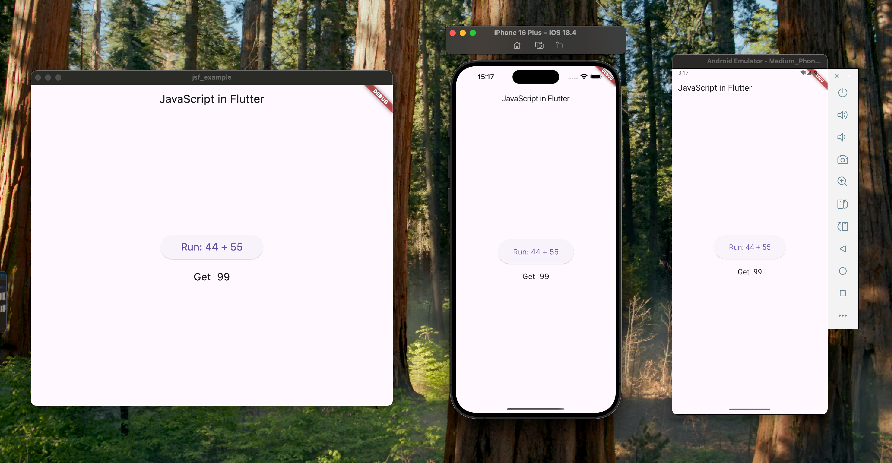

## JavaScript in Flutter

[English](README.md) &nbsp;&nbsp;&nbsp; [中文](README.ZH.md)  

A high performance JavaScript engine, available out of the box in Flutter.  

### Features

1. Simple and ready to use out of the box  
2. Up-to-date support for the latest QuickJS  
3. High-performance compilation strategy enabled by default  
4. Advanced features such as `big number` support enabled by default  
5. Web platform support via `dart:js_interop`  

### Getting Started

1. Add `jsf` as a [dependency](https://pub.dev/packages/jsf/install) in your `pubspec.yaml` file.  

2. Just use it:  

```dart
class Example extends StatefulWidget {
  const Example({super.key});

  @override
  State<Example> createState() => _ExampleState();
}

class _ExampleState extends State<Example> {
  String _result = '';
  final _js = JsRuntime();

  void _runJS() {
    final result = _js.eval('44 + 55');
    setState(() {
      _result = result;
    });
  }

  @override
  Widget build(BuildContext context) {
    return Scaffold(
      appBar: AppBar(title: const Text('JavaScript in Flutter')),
      body: Center(
        child: Column(
          mainAxisAlignment: MainAxisAlignment.center,
          children: [
            ElevatedButton(
              onPressed: _runJS,
              style: ElevatedButton.styleFrom(
                padding: const EdgeInsets.symmetric(
                  horizontal: 40,
                  vertical: 20,
                ),
                textStyle: const TextStyle(fontSize: 20),
              ),
              child: const Text('Run: 44 + 55'),
            ),
            const SizedBox(height: 20),
            Text('Get  $_result', style: const TextStyle(fontSize: 20)),
          ],
        ),
      ),
    );
  }

  @override
  void dispose() {
    _js.dispose();
    super.dispose();
  }
}
```

Run `flutter run`, then you will see:  

  
