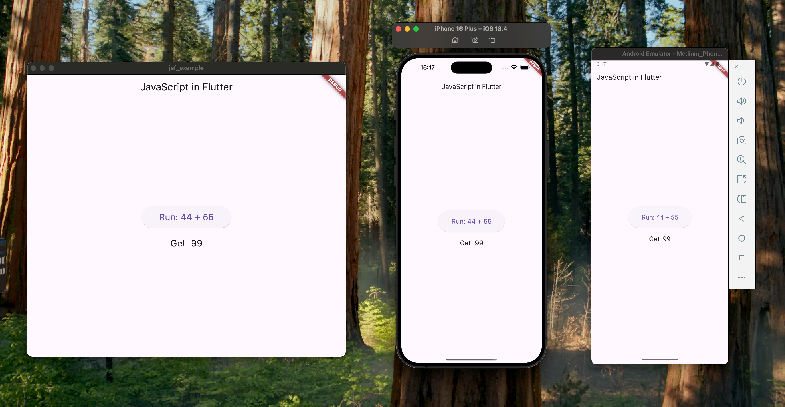

# JSF

[English](https://github.com/moluopro/jsf/blob/main/README.md) | [中文文档](https://github.com/moluopro/jsf/blob/main/README-ZH.md)

A high-performance JavaScript engine available out of the box in Flutter.

## Features

1. Up-to-date `QuickJS` support.
2. High-performance build strategy enabled by default.
3. `big number` and related features enabled by default.
4. Automatic type conversion with Dart and JavaScript interop.
5. Full platform support, including `Web` and `OpenHarmony`.



## Quick Start

```dart
import 'package:jsf/jsf.dart';

final js = JsRuntime();
print(js.eval('40 + 2')); // 42
js.dispose();
```

## Runtime Configuration

```dart
final js = JsRuntime(
  options: const JsRuntimeOptions(
    memoryLimitBytes: 64 * 1024 * 1024,
    maxStackSizeBytes: 1024 * 1024,
    timeout: Duration(seconds: 2),
  ),
);
```

`timeout` limits the duration of a synchronous JavaScript execution. Clear or replace it with:

```dart
js.clearTimeout();
js.setTimeout(const Duration(milliseconds: 500));
```

Idle time does not consume the execution limit, and `timeout` cannot interrupt a running Dart callback. `evalAsync(timeout: ...)` only limits how long you wait for the result. Web throws `UnsupportedError` for synchronous execution time limits, memory limits, and stack limits. Use `js.capabilities` to check platform support.

For long-running scripts or multiple concurrent tasks, configure these limits:

| Option | Default | Limits |
| --- | --- | --- |
| `maxTimers` | 1024 | Active timers on native platforms |
| `maxCallbacks` | 4096 | Registered Dart callbacks |
| `maxPendingFutures` | 4096 | Unresolved Dart Futures |
| `maxModuleSourceBytes` | 16 MiB | Total registered module source size |

Web timers are managed by the browser; the other three limits apply on Web too. `memoryLimitBytes` only limits JavaScript engine memory. Manage Dart data and network buffers separately.

## Values and Handles

Use `eval()` when you only need the result data. It automatically converts the JavaScript result to a Dart value:

```dart
final data = js.eval('({id: 1n, tags: ["a", "b"]})');
// {'id': BigInt.one, 'tags': ['a', 'b']}
```

Automatic conversion rules:

| JavaScript | Dart |
| --- | --- |
| `undefined` | `jsUndefined` |
| `null` | `null` |
| `boolean` | `bool` |
| integer number | `int` |
| floating-point number | `double` |
| `bigint` | `BigInt` |
| `string` | `String` |
| `Array` | `List<dynamic>` |
| plain object | `Map<String, dynamic>` |
| `Date` | `DateTime` |
| `Map` / `Set` | `Map<Object?, Object?>` / `Set<Object?>` |
| `RegExp` / `Error` | `JsRegExp` / `JsErrorDetails` |
| `ArrayBuffer` / TypedArray / DataView | `Uint8List` / `JsTypedArray` / `JsDataView` |
| `NaN` / `Infinity` / `-Infinity` | Dart special `double` values |

Objects and arrays are converted recursively; sparse array holes become `jsArrayHole`. Passing Dart values into JS supports `null`, `jsUndefined`, `bool`, `int`, `double`, `String`, `BigInt`, `DateTime`, `Uint8List`, `JsRegExp`, `JsErrorDetails`, `JsTypedArray`, `JsDataView`, `Set`, `List`, and `Map`.

`eval()` is for one-shot results and does not preserve JavaScript object identity. Use `evalValue()` when you need a `JsValue` handle:

- Calling JavaScript functions or object methods.
- Reading or writing object properties or array indexes.
- Awaiting an existing Promise.
- Handling circular references, class instances, DOM/host objects, TypedArray/ArrayBuffer, or values that cannot reliably become plain Dart maps/lists.
- Keeping the same JavaScript object identity across multiple calls.

Use `evalValue()` when you need to keep a JavaScript object/function handle:

```dart
final object = js.evalValue('({count: 2, items: [3, 4]})');
try {
  final count = object.getPropertyValue('count');
  try {
    print(count.toDart()); // 2
  } finally {
    count.dispose();
  }
} finally {
  object.dispose();
}
```

`JsValue.toDart()` uses the same conversion rules as `eval()`. Circular objects cannot be converted automatically:

```dart
final circular = js.evalValue('const v = {}; v.self = v; v');
try {
  circular.toDart(); // throws JsException
} finally {
  circular.dispose();
}
```

Owned `JsValue` handles must be disposed. Handles received inside `registerHandleFunction` are borrowed and only valid for the callback duration. Call `duplicate()` if you need to keep one.

Dart integers outside JavaScript's safe range become BigInt. On Web, use Dart `BigInt` directly for these values. `JsTypedArray.values` supports BigInt and nonfinite numbers. Dart maps with non-string keys become JS Map. Converted binary data is an independent copy; changing it does not modify the original.

Handles belong to their creating runtime. Use a scope to release temporary handles together:

```dart
final answer = withJsValues((scope) {
  final fn = scope.own(js.evalValue('(a, b) => a + b'));
  return scope.own(js.callValue(fn, [20, 22])).toDart();
});
```

Use `withJsValuesAsync` for async operations. To keep a handle after the scope ends, call `scope.release(value)` and dispose it yourself when finished.

## Dart Calls JavaScript

```dart
final add = js.evalValue('(function(a, b) { return a + b; })');
try {
  final result = js.callValue(add, [20, 22]);
  try {
    print(result.toDart()); // 42
  } finally {
    result.dispose();
  }
} finally {
  add.dispose();
}
```

For simple calls:

```dart
js.execInitScript('function join(prefix, values) { return prefix + values.join(","); }');
print(js.call('join', ['v:', [1, 2, 3]])); // v:1,2,3
```

## JavaScript Calls Dart

Use `registerFunction()` to expose a Dart function on the JavaScript global
object. JavaScript calls it like a normal function. Arguments are converted to
Dart values, and the return value is converted back to JavaScript:

```dart
js.registerFunction('dartSum', (args) {
  return args.cast<num>().reduce((a, b) => a + b);
});

print(js.eval('dartSum(4, 5, 6)')); // 15
```

Callbacks can receive multiple arguments and return convertible values such as
`Map`, `List`, `BigInt`, and `DateTime`:

```dart
js.registerFunction('receiveMessage', (args) {
  final name = args[0] as String;
  final payload = args[1] as Map;
  return {
    'ok': true,
    'message': '$name:${payload['count']}',
  };
});

print(js.eval('receiveMessage("counter", {count: 3}).message')); // counter:3
```

Callbacks may return `Future`; JavaScript receives a Promise, so JS can use
`await` or `.then()` directly:

```dart
js.registerFunction('loadUser', (args) async {
  return {'id': 1, 'name': 'Ada'};
});

final user = await js.evalAsync('loadUser().then((user) => user.name)');
```

With JavaScript `async/await`:

```dart
final name = await js.evalAsync('''
  (async () => {
    const user = await loadUser();
    return user.name;
  })()
''');
print(name); // Ada
```

`registerFunction()` converts JavaScript objects into Dart snapshots. Use
`registerHandleFunction()` when you need to preserve JavaScript object identity
or work with functions, class instances, circular objects, or host objects. It
passes arguments to Dart as `JsValue` handles:

```dart
js.registerHandleFunction('readModel', (args) {
  final model = args.first;
  final count = model.getPropertyValue('count');
  try {
    return count.toDart();
  } finally {
    count.dispose();
  }
});
```

Arguments received by `registerHandleFunction()` are borrowed handles and are
only valid for the callback duration. Call `duplicate()` if you need to keep one
outside the callback, and dispose the owned handle when finished.

Registration returns a `JsCallbackRegistration`. Dispose it or call `js.unregisterFunction(name)` to revoke the callback. After replacing a callback with the same name, JavaScript can no longer call the old function. Catch synchronous Dart failures with JavaScript `try/catch`; failed Futures reject the Promise. Dispose the runtime after the current JS call finishes. Calling `js.dispose()` inside a callback throws an error.

## Promise

When JavaScript returns a Promise, `evalAsync()` gives you the resolved Dart
value:

```dart
final value = await js.evalAsync('Promise.resolve({ok: true})');
print(value); // {'ok': true}
```

`evalAsync()` is also the normal way to call `async function`:

```dart
final result = await js.evalAsync('''
  async function compute() {
    const value = await Promise.resolve(21);
    return value * 2;
  }
  compute()
''');
print(result); // 42
```

You can also await an existing `JsValue`:

```dart
final promise = js.evalValue('Promise.resolve(42)');
try {
  print(await js.awaitValue(promise));
} finally {
  promise.dispose();
}
```

Dart `Future` values returned to JavaScript become Promises. This works for
both `registerFunction()` and `registerHandleFunction()`:

```dart
js.registerFunction('readConfig', (args) async {
  return {'theme': 'dark'};
});

final theme = await js.evalAsync('''
  readConfig().then((config) => config.theme)
''');
print(theme); // dark
```

## Fetch

Use JavaScript's `fetch()` to send HTTP requests and read JSON, text, or binary data. Enable it with `JsFetchOptions` when creating a runtime:

```dart
final js = JsRuntime(
  options: const JsRuntimeOptions(fetch: JsFetchOptions()),
);

final result = await js.evalAsync('''
  fetch('https://example.com/api').then(async response => {
    if (!response.ok) {
      await response.body?.cancel();
      throw new Error('HTTP ' + response.status);
    }
    return response.json();
  })
''');
print(result);
```

HTTP 4xx/5xx responses also return a Response, so check `response.ok` or `response.status`. Read the body with `text()`, `json()`, `bytes()`, `arrayBuffer()`, `blob()`, or `formData()`, depending on the response content. Each body can only be consumed once.

**Streaming responses**

Read `response.body` incrementally for AI output, SSE, and other streaming APIs. This example passes incoming UTF-8 text to Dart:

```dart
js.registerFunction('onChunk', (args) {
  print(args.first);
  return null;
});

await js.evalAsync('''
  (async () => {
    const response = await fetch('https://example.com/events');
    if (!response.ok) {
      await response.body?.cancel();
      throw new Error('HTTP ' + response.status);
    }
    const stream = response.body.pipeThrough(new TextDecoderStream());
    for await (const text of stream) {
      onChunk(text);
    }
  })()
''');
```

A text chunk may contain only part of an SSE event; parse it according to the API's format. To stop reading, call `response.body.cancel()`, or `reader.cancel()` if you acquired a reader. To cancel the entire request, pass an `AbortController.signal` to fetch and call `abort()`. An `evalAsync(timeout: ...)` timeout only stops the Dart wait; it does not cancel the network request.

**Uploading files and forms**

Use `FormData` in JavaScript to combine text fields and files. File contents can come from strings, ArrayBuffer, or TypedArray:

```javascript
const form = new FormData();
form.append('title', 'Sample attachment');
form.append('file', new File(
  [new Uint8Array([0, 128, 255])],
  'sample.bin',
  {type: 'application/octet-stream'},
));

fetch('https://example.com/upload', {
  method: 'POST',
  body: form,
}).then(async response => {
  if (!response.ok) {
    await response.body?.cancel();
    throw new Error('HTTP ' + response.status);
  }
  return response.json();
});
```

Do not set `Content-Type` manually when using FormData. Call `append()` multiple times to send repeated fields, or use `URLSearchParams` for URL-encoded forms. Supply Blob/File contents yourself; specifying a filename does not read a local file.

On native platforms, pass a `ReadableStream` as the request body to upload data as it is produced. Redirects such as 307/308 can resend fixed Blob/FormData content. A stream that cannot be read again causes an error when a redirect requires resending the body.

To customize network requests, pass a `JsFetchTransport` implementation through `JsFetchOptions.transport`. Implement `JsStreamingFetchTransport` to support streaming uploads.

`response.formData()` returns the complete form, limited by `maxBufferedBodyBytes`. On native platforms, use `response.formDataParts()` to process larger forms one part at a time. Each part is `{name, value}`, with a string or File value:

```javascript
for await (const part of response.formDataParts()) {
  await processPart(part.name, part.value);
}
```

Each part is returned after it has been read in full and must fit within `maxMultipartPartBytes`. Exiting the loop early cancels reading.

**Timeouts and size limits**

Configure common request settings through `JsFetchOptions`:

| Option | Default | Description |
| --- | --- | --- |
| `headersTimeout` | 30 seconds | Maximum wait for response headers, including redirects |
| `bodyIdleTimeout` | 30 seconds | Maximum wait for the next chunk while reading the body |
| `timeout` | `null` | Time limit for the entire request; unlimited by default |
| `maxConcurrentRequests` | 16 | Maximum number of requests in progress |
| `uploadIdleTimeout` | 30 seconds | Maximum wait for the next chunk to upload |
| `maxTotalBufferedBytes` | 32 MiB | Shared transfer buffer limit for native requests |
| `maxMultipartPartBytes` | 8 MiB | Per-part buffer limit for incremental form parsing |
| `maxRequestBytes` | 8 MiB | Upload size limit, including encoded form data |
| `maxBufferedBodyBytes` | 8 MiB | Body size limit when reading all content with methods such as text/json |

`maxTotalBufferedBytes` only limits data buffered during transfer. Manage data created or retained by your scripts separately.

For long-lived connections, keep `timeout: null` and increase `bodyIdleTimeout` to match the server's heartbeat interval, or set it to null. Read larger downloads incrementally through `response.body`, or raise `maxBufferedBodyBytes` to read them in full. Set `maxResponseBytes` if you need a total response size limit that also applies to streaming reads.

These settings apply to Android, iOS, macOS, Windows, Linux, and OHOS. Native requests do not manage cookies automatically; authentication can use an Authorization header. Web uses browser Fetch, including the browser's cross-origin, credential, and request rules.

Call `js.dispose()` when finished with the runtime. Any requests still in progress will be cancelled.

## ES Modules

Register modules in memory:

```dart
js.registerModules({
  'math': 'export const answer = 42; export function inc(v) { return v + 1; }',
  'consumer': 'import { answer, inc } from "math"; export const result = inc(answer);',
  'pkg/relative': 'import { answer } from "../math"; export const result = answer;',
});

js.registerImportMap({'@math': 'math'});

js.eval(
  'import { result } from "consumer"; globalThis.result = result;',
  filename: 'main',
  module: true,
);

print(js.eval('result')); // 43
print(await js.evalAsync('import("@math").then((m) => m.inc(m.answer))')); // 43
```

Register a Flutter asset as a module:

```dart
await js.registerModuleFromAsset('app/config', 'assets/config.js');
```

Native platforms and Web share the same module registration API, with relative paths, import maps, static imports, dynamic `import()`, cycles, and re-exports. Use `evalAsync` for modules with top-level await. Register module sources before importing them; sources are not downloaded automatically.

Web does not currently support import attributes. With circular dependencies, wait until a dependency has initialized before reading its exported variables or classes; earlier reads may behave differently from native platforms. The page's Content Security Policy (CSP) must allow dynamic JavaScript execution and same-origin iframes.

`clearModules()` clears registered sources and import maps while keeping already loaded modules. To load changed code, use a new module name or create a new runtime.

## Exceptions

JavaScript exceptions are thrown as `JsException`:

```dart
try {
  js.eval('throw new Error("boom")');
} on JsException catch (error) {
  print(error.message);
}
```

`JsException` exposes `name`, `message`, `stack`, and optional `cause`. Use `name` to distinguish error types and `stack` to locate the failing call. On native platforms, `cause` is a text description.

## JavaScript APIs and Diagnostics

On native platforms, use `setTimeout` / `setInterval`, `clearTimeout` / `clearInterval`, `queueMicrotask`, `URL` / `URLSearchParams`, UTF-8 `TextEncoder` / `TextDecoder`, and `AbortController` / `AbortSignal.abort/any/timeout` without enabling Fetch. Web uses the corresponding browser APIs.

Use `JsRuntimeOptions(onConsole: ..., onUnhandledRejection: ..., onError: ...)` to receive console output, unhandled Promise errors, and timer or async-task failures. To check resource usage, read `js.statistics` for handles, callbacks, pending Futures, module source size, and native memory and request counts. Metrics unavailable on the current platform are `null`.

## Background execution

`evalAsync` does not automatically move computation to the background. On native platforms, use `JsWorker` for expensive scripts to avoid blocking the current isolate:

```dart
final worker = await JsWorker.start();
try {
  print(await worker.eval('40 + 2', timeout: const Duration(seconds: 2)));
} finally {
  await worker.dispose();
}
```

Workers process requests in order, with up to 128 outstanding requests and a five-second synchronous JS execution limit by default. Inputs and results are copied data; `JsValue` handles, Dart callbacks, and custom network transports are not accepted. A request timeout closes the worker and cancels its remaining requests. Wait for `dispose()` to complete before assuming resources have been released. `JsWorker` is not currently supported on Web.

## Threading and Lifecycle

- Runtimes have independent global variables. Use each `JsValue` only with its own runtime.
- Use a runtime from the same Dart isolate that created it.
- Dispose every runtime with `dispose()`.
- Dispose owned `JsValue` handles when you are done.
- Do not use handles after their runtime is disposed.
- Disposing a runtime also releases its owned handles. Release unused handles promptly to reduce memory usage.

Web scripts retain the page's same-origin access permissions. Independent globals do not provide a security sandbox for untrusted scripts. When enabling native Fetch, use `allowRequest` to restrict request and redirect destinations.

Native platforms do not provide automatic cookie management, HTTP caching, CORS emulation, WebSocket, DOM, or Node.js built-in modules. Check a third-party JavaScript library's required APIs before using it.
